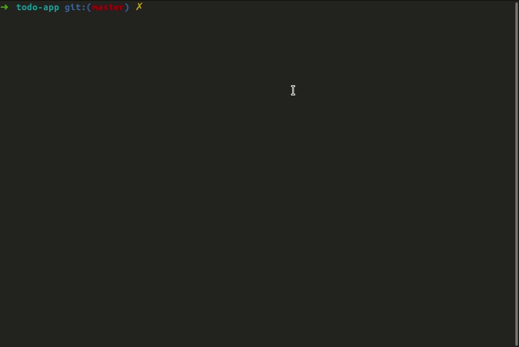
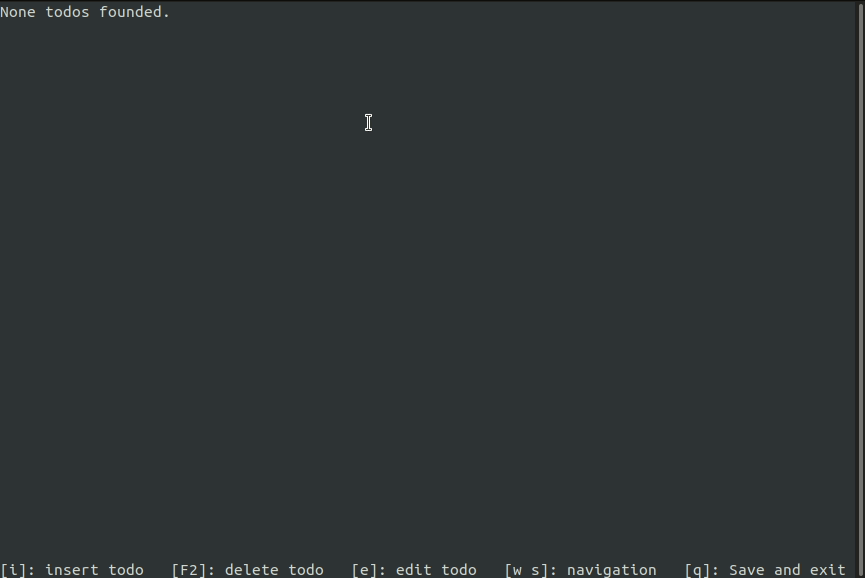
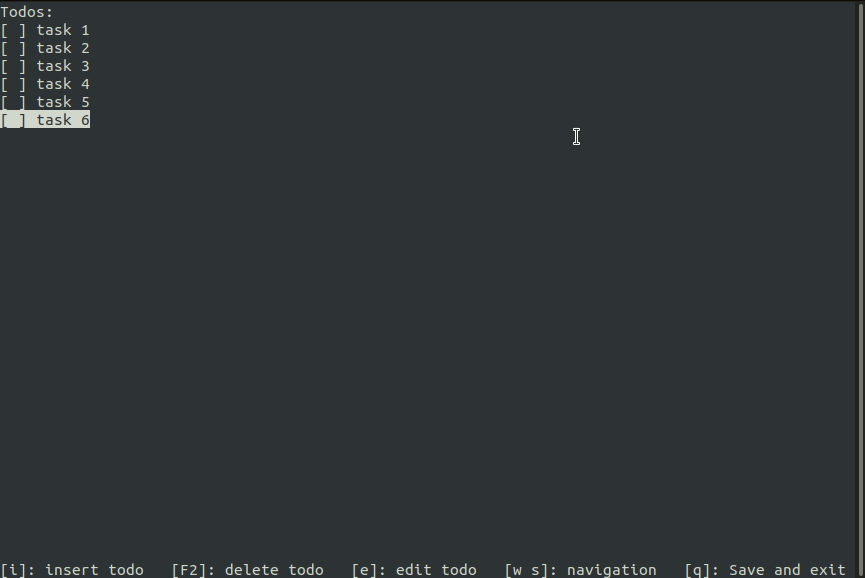
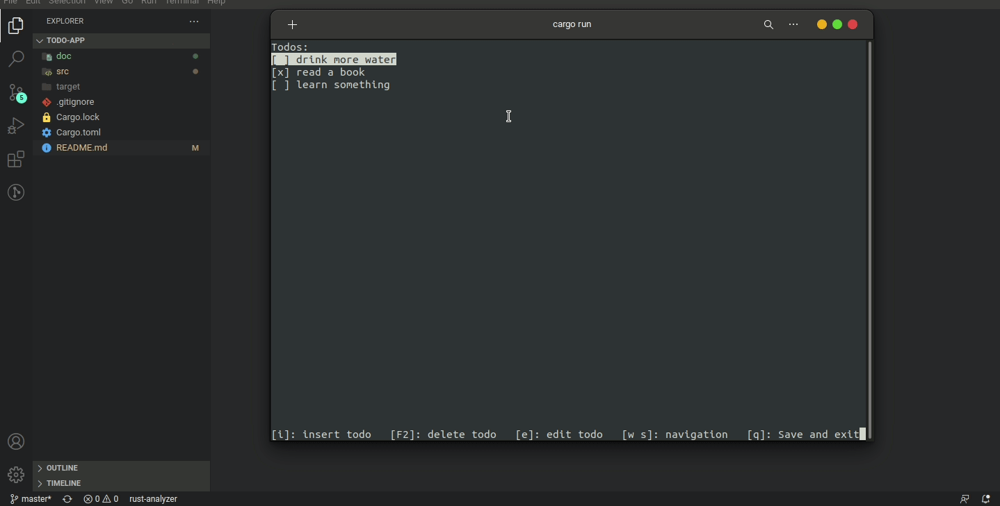

# Todo-app
A simple todo app made with Rust and pancurses lib


Clone this repository and run

```console
cargo run
```


<br>
<h2>You can create, edit and delete a todo</h2>


<h2>You also can toggle todo status</h2>


<h2>By pressing 'q' your todo's will be saved in a file called "todo.txt"</h2>
